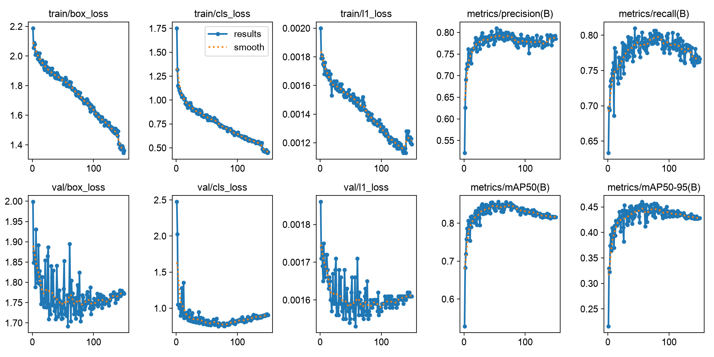
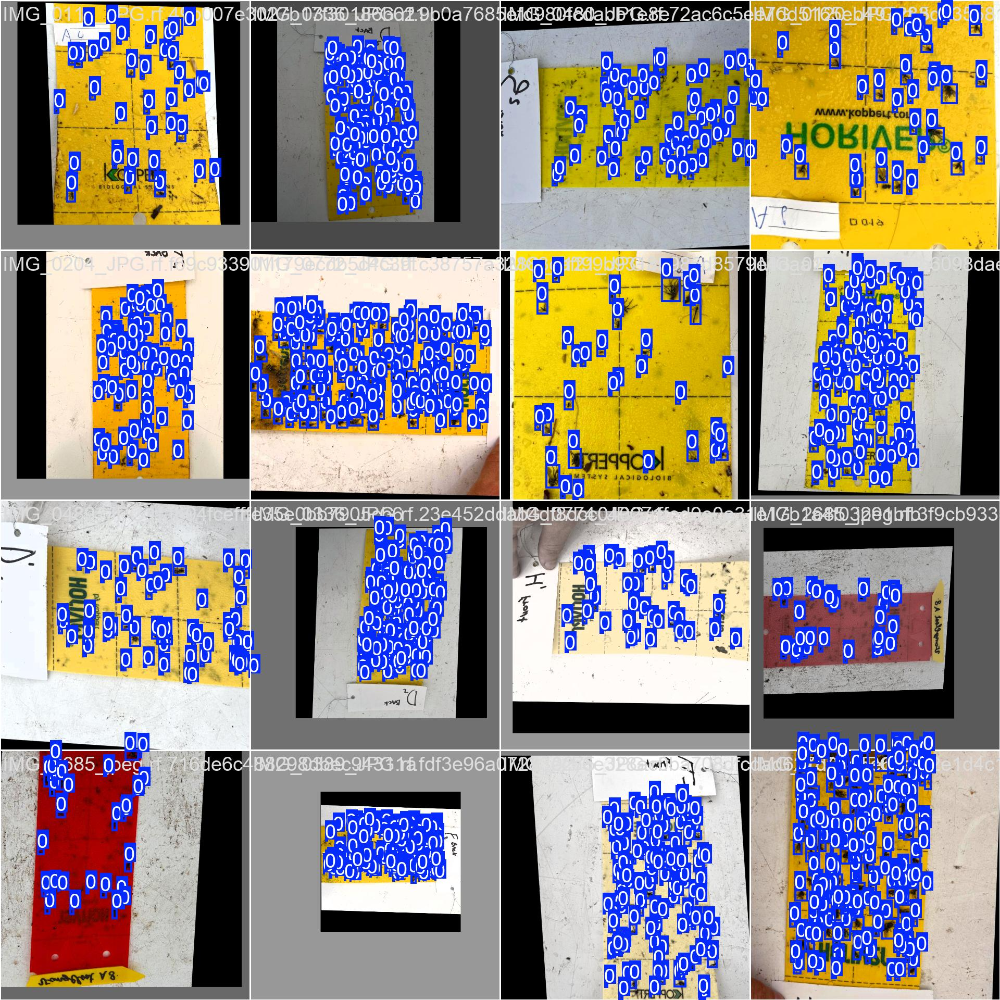
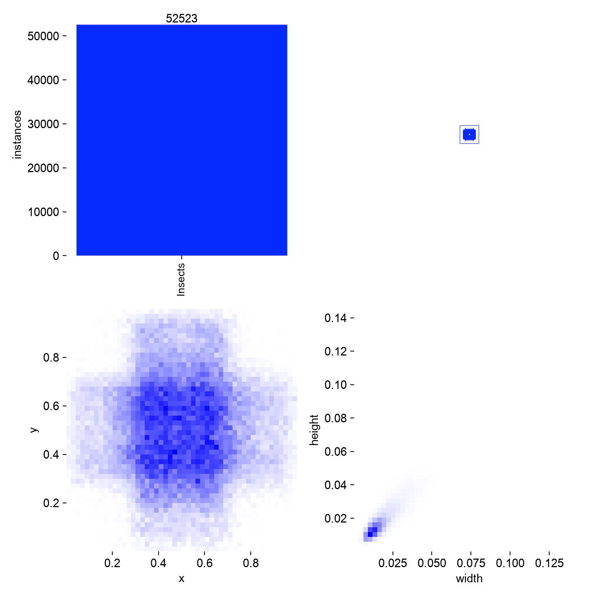

# Model performance

This folder contains the saved weights from the training.

## Nano

To come...

## Small

The model was trained on the 16.09.2026 using the follwing parameters:

```bash
model.train(data=data_path, epochs=150, device="mps", imgsz=1024, patience=150)
```

#### The training parameters can be seen below:



#### This batch does contain red cards, which can now be also used for insect identifaction and counting:



#### Information on boundingboxes and object size:



## Medium

To come...

## Large

To come...
